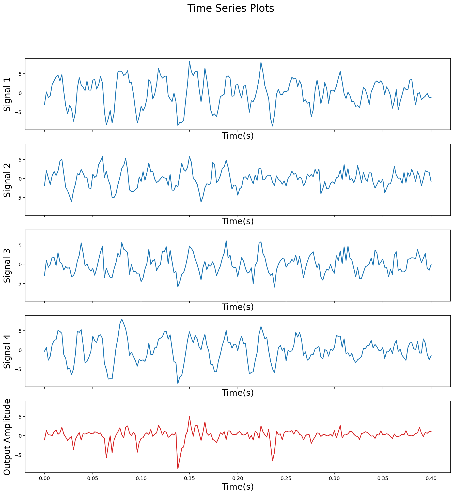
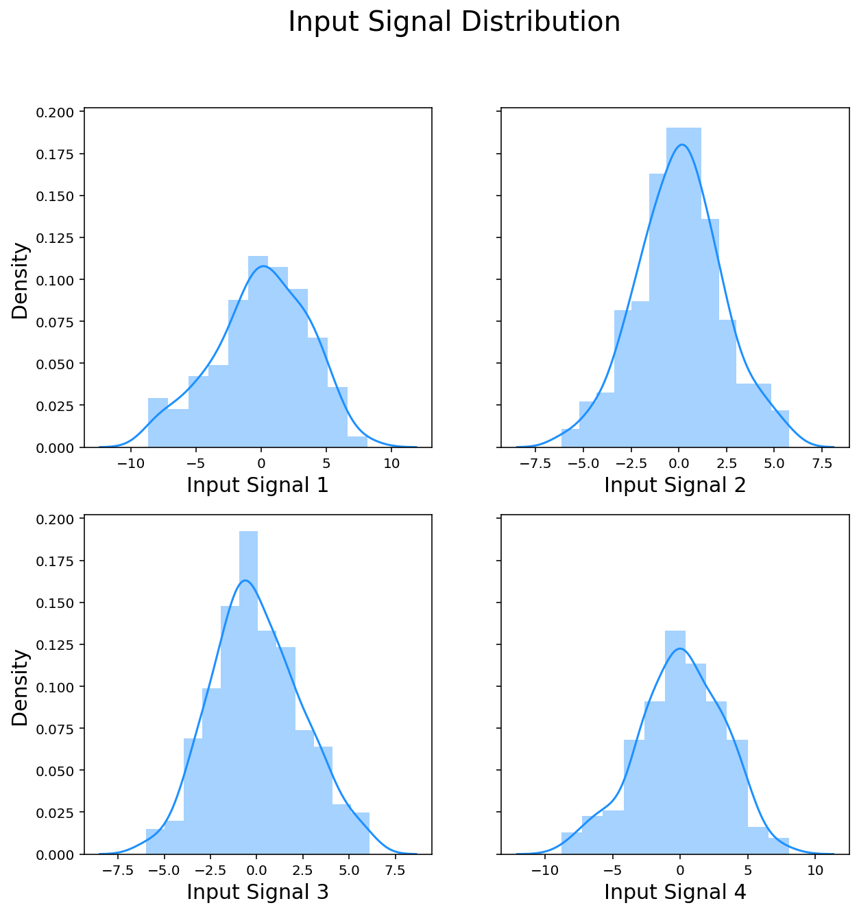
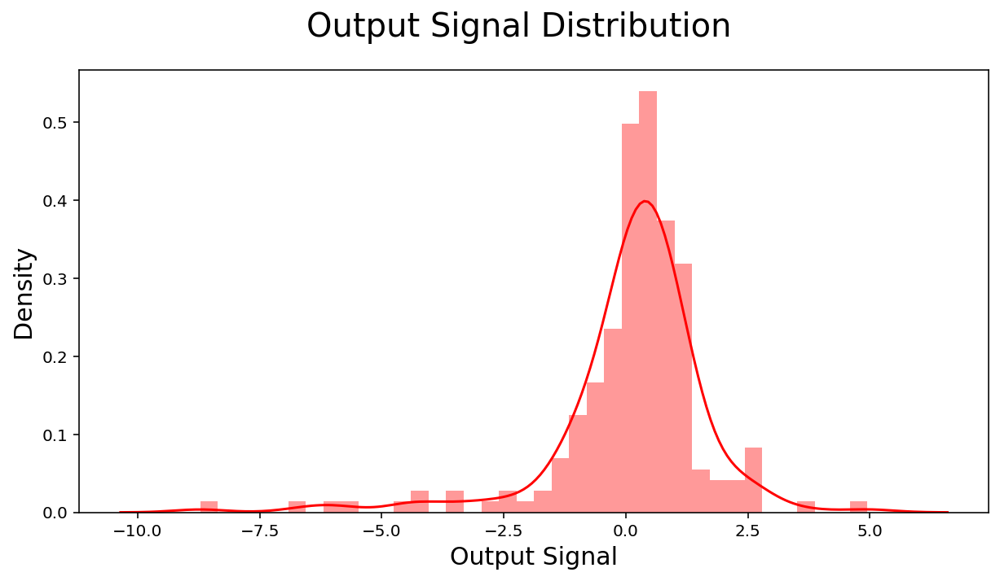
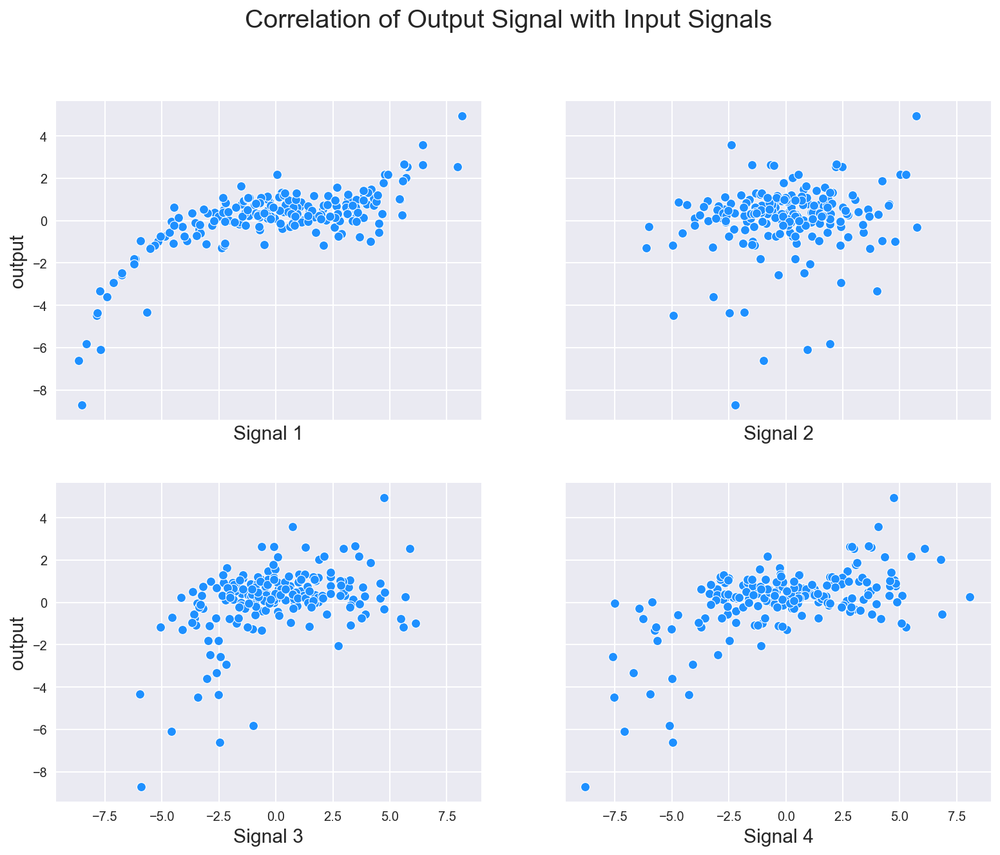
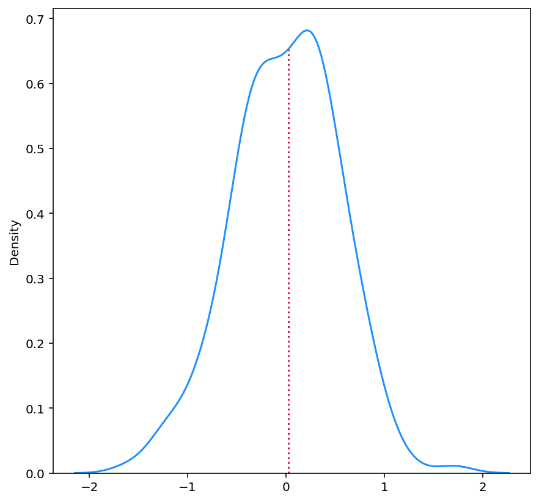
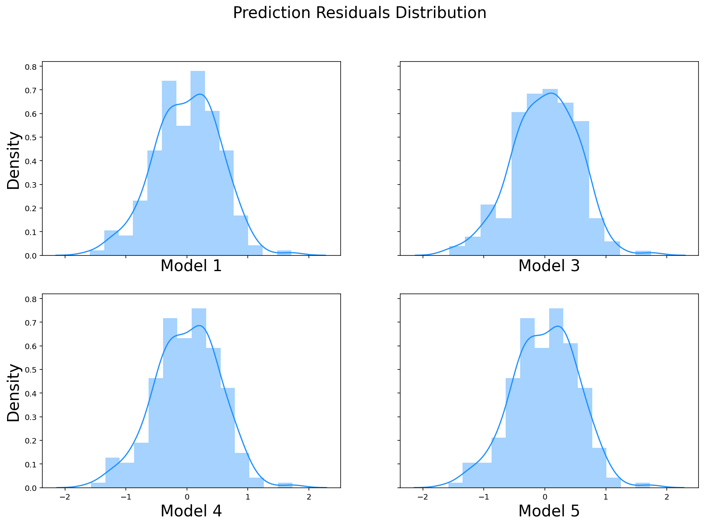
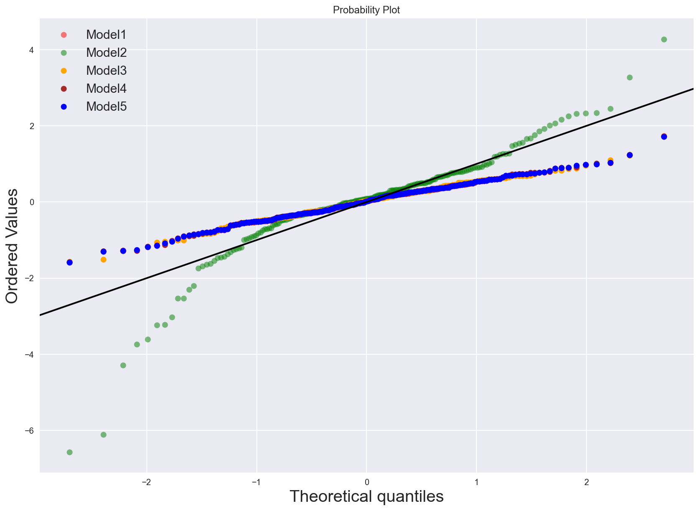
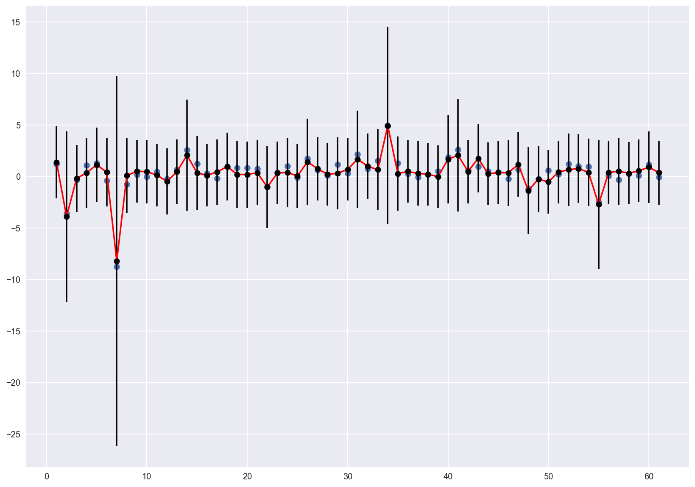
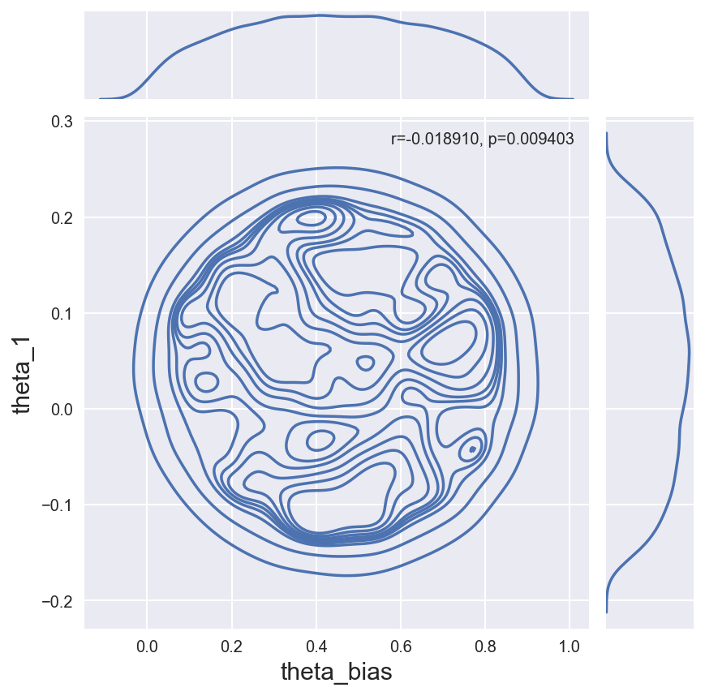
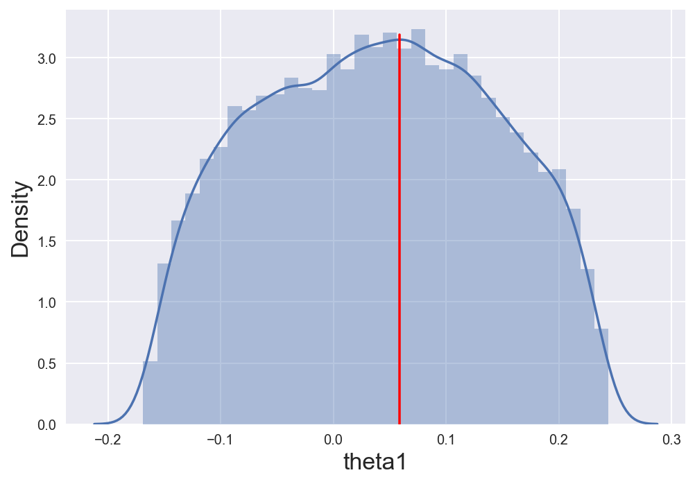

```python
import pandas as pd
import numpy as np
import math as m
import scipy as sp
from scipy import stats
import statsmodels.api as sm
import pylab
import matplotlib.pyplot as plt 
import seaborn as sns
from sklearn.model_selection import train_test_split
%matplotlib inline
%config InlineBackend.figure_format='retina'
import warnings
warnings.filterwarnings('ignore')
```


```python
from platform import python_version

print(python_version())
```

    3.8.5


```python
X = pd.read_csv('ced4af35ca8f072dfcfe0b23e8cb324fx.csv', header=None)
y = pd.read_csv('aab2bd7fe40cf91d3550c23007910532y.csv', header=None)
time = pd.read_csv('7bdf781b71e5c0e9b2729d6944cf1d1ctime.csv', header=None)
```

## Task 1: Preliminary data analysis


```python
print(X.shape, y.shape, time.shape)
```

    (201, 4) (201, 1) (201, 1)


```python
time.rename(columns={0:'t'}, inplace=True)
X.head(5)
```


<div>
<style scoped>
    .dataframe tbody tr th:only-of-type {
        vertical-align: middle;
    }

    .dataframe tbody tr th {
        vertical-align: top;
    }

    .dataframe thead th {
        text-align: right;
    }
</style>
<table border="1" class="dataframe">
  <thead>
    <tr style="text-align: right;">
      <th></th>
      <th>0</th>
      <th>1</th>
      <th>2</th>
      <th>3</th>
    </tr>
  </thead>
  <tbody>
    <tr>
      <th>0</th>
      <td>-3.061566</td>
      <td>-1.865197</td>
      <td>-2.909812</td>
      <td>-0.339428</td>
    </tr>
    <tr>
      <th>1</th>
      <td>0.244694</td>
      <td>2.039161</td>
      <td>0.999302</td>
      <td>0.612228</td>
    </tr>
    <tr>
      <th>2</th>
      <td>-1.200967</td>
      <td>0.177409</td>
      <td>-0.796548</td>
      <td>-2.677010</td>
    </tr>
    <tr>
      <th>3</th>
      <td>-0.727982</td>
      <td>-1.556615</td>
      <td>0.010395</td>
      <td>-1.623008</td>
    </tr>
    <tr>
      <th>4</th>
      <td>2.204928</td>
      <td>0.766196</td>
      <td>1.868107</td>
      <td>1.431368</td>
    </tr>
  </tbody>
</table>
</div>


```python
all_headers = [X[0], X[1], X[2], X[3], y[0], time["t"]]

headers = ["sig1", "sig2", "sig3", "sig4", "output", "time"]

combined = pd.concat(all_headers, axis=1, keys=headers)
```


```python
combined.head()
```


<div>
<style scoped>
    .dataframe tbody tr th:only-of-type {
        vertical-align: middle;
    }

    .dataframe tbody tr th {
        vertical-align: top;
    }

    .dataframe thead th {
        text-align: right;
    }
</style>
<table border="1" class="dataframe">
  <thead>
    <tr style="text-align: right;">
      <th></th>
      <th>sig1</th>
      <th>sig2</th>
      <th>sig3</th>
      <th>sig4</th>
      <th>output</th>
      <th>time</th>
    </tr>
  </thead>
  <tbody>
    <tr>
      <th>0</th>
      <td>-3.061566</td>
      <td>-1.865197</td>
      <td>-2.909812</td>
      <td>-0.339428</td>
      <td>-1.116785</td>
      <td>0.000</td>
    </tr>
    <tr>
      <th>1</th>
      <td>0.244694</td>
      <td>2.039161</td>
      <td>0.999302</td>
      <td>0.612228</td>
      <td>1.333889</td>
      <td>0.002</td>
    </tr>
    <tr>
      <th>2</th>
      <td>-1.200967</td>
      <td>0.177409</td>
      <td>-0.796548</td>
      <td>-2.677010</td>
      <td>0.216063</td>
      <td>0.004</td>
    </tr>
    <tr>
      <th>3</th>
      <td>-0.727982</td>
      <td>-1.556615</td>
      <td>0.010395</td>
      <td>-1.623008</td>
      <td>0.176452</td>
      <td>0.006</td>
    </tr>
    <tr>
      <th>4</th>
      <td>2.204928</td>
      <td>0.766196</td>
      <td>1.868107</td>
      <td>1.431368</td>
      <td>0.011043</td>
      <td>0.008</td>
    </tr>
  </tbody>
</table>
</div>


#### Time Series Plots


```python
fig, axs = plt.subplots(5, sharex=True, sharey=True, figsize=(15,15))
fig.suptitle('Time Series Plots', size=20)
axs[0].plot(combined['time'], combined['sig1'])
axs[1].plot(combined['time'], combined['sig2'])
axs[2].plot(combined['time'], combined['sig3'])
axs[3].plot(combined['time'], combined['sig4'])
axs[4].plot(combined['time'], combined['output'], 'tab:red')

#axs[4].plot(combined['time'], X_matrix3@theta_model3, 'tab:orange')
#axs[4].plot(combined['time'], X_matrix1@theta_model1, 'tab:blue')


n=1
for each in axs.flat: 
    if n > 4:
        axs[4].xaxis.get_label().set_fontsize(17)
        axs[4].yaxis.get_label().set_fontsize(17)
        axs[4].set(ylabel='Output Amplitude')
        axs[4].set(xlabel='Time(s)')
    else:  
        each.xaxis.get_label().set_fontsize(17)
        each.yaxis.get_label().set_fontsize(17)
        each.set(xlabel='Time(s)')
        each.set(ylabel=f'Signal {n}')
        n+=1;
    
```


    

    


#### Distribution of each EEG signal


```python
fig, ax = plt.subplots(2, 2, sharey=True, figsize=(10,10))
fig.suptitle('Input Signal Distribution', size=20)

sns.distplot(combined['sig1'] , color="dodgerblue", ax=ax[0,0], axlabel='Input Signal 1')
sns.distplot(combined['sig2'] , color="dodgerblue", ax=ax[0,1], axlabel='Input Signal 2')
sns.distplot(combined['sig3'] , color="dodgerblue", ax=ax[1,0], axlabel='Input Signal 3')
sns.distplot(combined['sig4'] , color="dodgerblue", ax=ax[1,1], axlabel='Input Signal 4');

for each in ax.flat:
    each.xaxis.get_label().set_fontsize(15)
    each.yaxis.get_label().set_fontsize(15)

fig1, ax1 = plt.subplots(1, figsize=(10,5))
fig1.suptitle('Output Signal Distribution', size=20)
ax1.xaxis.get_label().set_fontsize(15)
ax1.yaxis.get_label().set_fontsize(15)


sns.distplot(combined['output'] , color="red", ax=ax1, axlabel='Output Signal');
```


    

    


    

    


#### Correlation between input signals and output


```python
combined.corr() 

# Comment above line, and uncomment below line to view output correlations
# combined.corr()['output']
```


<div>
<style scoped>
    .dataframe tbody tr th:only-of-type {
        vertical-align: middle;
    }

    .dataframe tbody tr th {
        vertical-align: top;
    }

    .dataframe thead th {
        text-align: right;
    }
</style>
<table border="1" class="dataframe">
  <thead>
    <tr style="text-align: right;">
      <th></th>
      <th>sig1</th>
      <th>sig2</th>
      <th>sig3</th>
      <th>sig4</th>
      <th>output</th>
      <th>time</th>
    </tr>
  </thead>
  <tbody>
    <tr>
      <th>sig1</th>
      <td>1.000000</td>
      <td>0.261976</td>
      <td>0.583522</td>
      <td>0.805769</td>
      <td>0.728899</td>
      <td>-0.018324</td>
    </tr>
    <tr>
      <th>sig2</th>
      <td>0.261976</td>
      <td>1.000000</td>
      <td>0.520733</td>
      <td>0.365883</td>
      <td>0.166396</td>
      <td>0.011839</td>
    </tr>
    <tr>
      <th>sig3</th>
      <td>0.583522</td>
      <td>0.520733</td>
      <td>1.000000</td>
      <td>0.710720</td>
      <td>0.406975</td>
      <td>0.031976</td>
    </tr>
    <tr>
      <th>sig4</th>
      <td>0.805769</td>
      <td>0.365883</td>
      <td>0.710720</td>
      <td>1.000000</td>
      <td>0.570508</td>
      <td>-0.004517</td>
    </tr>
    <tr>
      <th>output</th>
      <td>0.728899</td>
      <td>0.166396</td>
      <td>0.406975</td>
      <td>0.570508</td>
      <td>1.000000</td>
      <td>0.091947</td>
    </tr>
    <tr>
      <th>time</th>
      <td>-0.018324</td>
      <td>0.011839</td>
      <td>0.031976</td>
      <td>-0.004517</td>
      <td>0.091947</td>
      <td>1.000000</td>
    </tr>
  </tbody>
</table>
</div>


```python

```

#### Scatter Plots between input signals and output signals


```python
fig, ax = plt.subplots(2, 2, sharey=True, sharex=True, figsize=(13,10))
fig.suptitle('Correlation of Output Signal with Input Signals', size=20)

ax[0,0].set(xlabel='Signal 1')
ax[0,1].set(xlabel='Signal 2')
ax[1,0].set(xlabel='Signal 3')
ax[1,1].set(xlabel='Signal 4')


sns.scatterplot(x=combined['sig1'], y=combined['output'], color="dodgerblue", ax=ax[0,0])
sns.scatterplot(x=combined['sig2'], y=combined['output'], color="dodgerblue", ax=ax[0,1])
sns.scatterplot(x=combined['sig3'], y=combined['output'], color="dodgerblue", ax=ax[1,0])
sns.scatterplot(x=combined['sig4'], y=combined['output'], color="dodgerblue", ax=ax[1,1]);

for each in ax.flat:
    each.xaxis.get_label().set_fontsize(15)
    each.yaxis.get_label().set_fontsize(15);

#combined.plot(x='sig1', y='output', kind='scatter');
```


    

    


```python

```

## Task 2: Regression – modelling the relationship between EEG signals

### Task 2.1:
Estimate model parameters 𝜽 = {𝜃<sub>1</sub>,𝜃<sub>2</sub>,⋯,𝜃<sub>𝑏𝑖𝑎𝑠</sub>}<sup>𝑇</sup> for every candidate model using Least Squares (𝜽 = (𝐗<sup>𝑇</sup>𝐗)<sup>−1</sup>𝐗<sup>𝑇</sup>𝐲), using the provided input and output EEG datasets (use all the data for training).


```python
def estimate_theta(x_matrix, y):
    """Estimates model parameters using Least Squares"""
    theta = np.linalg.inv(x_matrix.transpose() @ x_matrix) @ x_matrix.transpose() @ y
    return theta

ones = np.array(201*[1])
x1 = combined['sig1']
x2 = combined['sig2']
x3 = combined['sig3']
x4 = combined['sig4']
y0 = combined['output']

```


```python
# Model 1

X_matrix1 = np.transpose([x4, x1**2, x1**3, x3**4, ones])
theta_model1 = estimate_theta(x_matrix=X_matrix1, y=y0)
theta_model1
```


    array([-0.03410198, -0.00184957,  0.01038181, -0.00194915,  0.46855169])


```python
# Model 2
X_matrix2 = np.transpose([x3**3, x3**4, ones])
theta_model2 = estimate_theta(x_matrix=X_matrix2, y=y0)
theta_model2
```


    array([ 0.01633468, -0.00271399,  0.30350114])


```python
# Model 3
X_matrix3 = np.transpose([x2, x1**3, x3**4, ones])
theta_model3 = estimate_theta(x_matrix=X_matrix3, y=y0)
theta_model3
```


    array([ 0.03810926,  0.0098278 , -0.00209256,  0.44829955])


```python
# Model 4
X_matrix4 = np.transpose([x4, x1**3, x3**4, ones])
theta_model4 = estimate_theta(x_matrix=X_matrix4, y=y0)
theta_model4
```


    array([-0.03488177,  0.01048218, -0.0019905 ,  0.45032921])


```python
# Model 5
X_matrix5 = np.transpose([x4, x1**2, x1**3, x3**4, x1**4, ones])
theta_model5 = estimate_theta(x_matrix=X_matrix5, y=y0)
theta_model5
```


    array([-3.39531264e-02, -2.70164450e-04,  1.03476430e-02, -1.94345218e-03,
           -3.08319409e-05,  4.60656009e-01])


### Task 2.2:
Based on the estimated model parameters, compute the **model residual (error) sum of squared errors (RSS**), for every candidate model.


```python
def compute_RSS(actual_y, input_x, theta):
    """Computes the model residual sum of squared errors given candidate models"""
    
    summation = 0
    for x,y in zip(input_x, actual_y):
        #summation = summation + np.square(abs(y - (x@theta)))
        summation = summation + np.square(y - (x@theta))
        
    return summation
            
```


```python

```


```python

```


```python
rss1 = compute_RSS(y0, X_matrix1, theta_model1)
rss2 = compute_RSS(y0, X_matrix2, theta_model2)
rss3 = compute_RSS(y0, X_matrix3, theta_model3)
rss4 = compute_RSS(y0, X_matrix4, theta_model4)
rss5 = compute_RSS(y0, X_matrix5, theta_model5)

print(f'Model 1 RSS: {rss1:.3f}')
print(f'Model 2 RSS: {rss2:.3f}')
print(f'Model 3 RSS: {rss3:.3f}')
print(f'Model 4 RSS: {rss4:.3f}')
print(f'Model 5 RSS: {rss5:.3f}')
```

    Model 1 RSS: 57.329
    Model 2 RSS: 351.415
    Model 3 RSS: 57.325
    Model 4 RSS: 57.464
    Model 5 RSS: 57.309


### Task 2.3:
Compute the log-likelihood function for every candidate model:


```python
def compute_log_likelihood(rss, n):
    """Computes the log likelihood function given residual sum of squared errors
    and number of samples n"""
    
    sigma_sq = rss/(n-1)
    
    log_likelihood = -((n/2)*m.log(2*m.pi)) - (n/2)*m.log(sigma_sq) - (1/(2*sigma_sq))*rss
    return log_likelihood
    
```


```python
llh1 = compute_log_likelihood(rss1, len(y0))
llh2 = compute_log_likelihood(rss2, len(y0))
llh3 = compute_log_likelihood(rss3, len(y0))
llh4 = compute_log_likelihood(rss4, len(y0))
llh5 = compute_log_likelihood(rss5, len(y0))

print(f'Model 1 Log Likelihood: {llh1:.3f}')
print(f'Model 2 Log Likelihood: {llh2:.3f}')
print(f'Model 3 Log Likelihood: {llh3:.3f}')
print(f'Model 4 Log Likelihood: {llh4:.3f}')
print(f'Model 5 Log Likelihood: {llh5:.3f}')
```

    Model 1 Log Likelihood: -159.131
    Model 2 Log Likelihood: -341.353
    Model 3 Log Likelihood: -159.124
    Model 4 Log Likelihood: -159.367
    Model 5 Log Likelihood: -159.096


```python
# Compute maximum log-likelihood value
max([llh1, llh2, llh3, llh4, llh5])
```


    -159.09615673367685


### Task 2.4:
Compute the **Akaike information criterion (AIC)** and **Bayesian information criterion (BIC)** for every candidate model:


```python
import math as m

def compute_AIC(llh, k):
    aic = 2*k - 2*llh
    return aic

def compute_BIC(llh, k, n=len(y0)):
    bic = k*m.log(n) - 2*llh
    return bic    
```


```python
aic1 = compute_AIC(llh1, k=5)
aic2 = compute_AIC(llh2, k=3)
aic3 = compute_AIC(llh3, k=4)
aic4 = compute_AIC(llh4, k=4)
aic5 = compute_AIC(llh5, k=6)

bic1 = compute_BIC(llh1, k=5)
bic2 = compute_BIC(llh2, k=3)
bic3 = compute_BIC(llh3, k=4)
bic4 = compute_BIC(llh4, k=4)
bic5 = compute_BIC(llh5, k=6)

all_aic = [aic1, aic2, aic3, aic4, aic5]
aic_min = min(all_aic)
all_bic = [bic1, bic2, bic3, bic4, bic5]
bic_min = min(all_bic)

print(f'Model 1 AIC: {aic1:.2f}, AIC difference: {aic1 - aic_min:.2f}, BIC: {bic1:.2f}, BIC difference: {bic1 - bic_min:.2f}')
print(f'Model 2 AIC: {aic2:.2f}, AIC difference: {aic2 - aic_min:.2f}, BIC: {bic2:.2f}, BIC difference: {bic2 - bic_min:.2f}')
print(f'Model 3 AIC: {aic3:.2f}, AIC difference: {aic3 - aic_min:.2f}, BIC: {bic3:.2f}, BIC difference: {bic3 - bic_min:.2f}')
print(f'Model 4 AIC: {aic4:.2f}, AIC difference: {aic4 - aic_min:.2f}, BIC: {bic4:.2f}, BIC difference: {bic4 - bic_min:.2f}')
print(f'Model 5 AIC: {aic5:.2f}, AIC difference: {aic5 - aic_min:.2f}, BIC: {bic5:.2f}, BIC difference: {bic5 - bic_min:.2f}')
```

    Model 1 AIC: 328.26, AIC difference: 2.01, BIC: 344.78, BIC difference: 5.32
    Model 2 AIC: 688.71, AIC difference: 362.46, BIC: 698.62, BIC difference: 359.15
    Model 3 AIC: 326.25, AIC difference: 0.00, BIC: 339.46, BIC difference: 0.00
    Model 4 AIC: 326.73, AIC difference: 0.49, BIC: 339.95, BIC difference: 0.49
    Model 5 AIC: 330.19, AIC difference: 3.94, BIC: 350.01, BIC difference: 10.55


### Task 2.5:
Check the distribution of model prediction errors (residuals) for each candidate model. Plot the error distributions, and evaluate if those distributions are close to Normal/Gaussian (as the output EEG has additive Gaussian noise), e.g. by using Q-Q plot.


```python
def compute_prediction_errors(actual_y, input_x, theta):
    """Computes the model residual sum of squared errors given candidate models"""
    
    errors = []
    for x,y in zip(input_x, actual_y):
        errors.append(y - (x@theta))
        
    return errors           
```


```python
errors1 = compute_prediction_errors(y0, X_matrix1, theta_model1)
errors2 = compute_prediction_errors(y0, X_matrix2, theta_model2)
errors3 = compute_prediction_errors(y0, X_matrix3, theta_model3)
errors4 = compute_prediction_errors(y0, X_matrix4, theta_model4)
errors5 = compute_prediction_errors(y0, X_matrix5, theta_model5)
```


```python
fig, ax = plt.subplots(1, figsize=(7,7))
sns.kdeplot(errors1, color="dodgerblue", ax=ax)
meant = np.median(errors1)
kdeline = ax.lines[0]
xs = kdeline.get_xdata()
ys = kdeline.get_ydata()
height = np.interp(meant, xs, ys)
ax.vlines(meant, 0, height, color='crimson', ls=':');
```


    <matplotlib.collections.LineCollection at 0x1271210a0>


    

    


```python
fig, ax = plt.subplots(2, 2, sharey=True, sharex=True, figsize=(15,10))
fig.suptitle('Prediction Residuals Distribution', size=20)

ax[0,0].set(xlabel='Model 1')
ax[0,1].set(xlabel='Model 3')
ax[1,0].set(xlabel='Model 4')
ax[1,1].set(xlabel='Model 5')


sns.distplot(errors1, color="dodgerblue", ax=ax[0,0], axlabel='Model 1')
#sns.distplot(errors2, color="dodgerblue", ax=ax[0], axlabel='Model 2', bins=201);
sns.distplot(errors3, color="dodgerblue", ax=ax[0,1], axlabel='Model 3');
sns.distplot(errors4, color="dodgerblue", ax=ax[1,0], axlabel='Model 4')
sns.distplot(errors5, color="dodgerblue", ax=ax[1,1], axlabel='Model 5');

for each in ax.flat:
    each.xaxis.get_label().set_fontsize(20)
    each.yaxis.get_label().set_fontsize(20);
```


    

    


```python
plt.style.use('seaborn')

fig, ax = plt.subplots(1, 1, figsize=(14, 10))
stats.probplot(errors1, dist=stats.norm, plot=plt, fit=False)
stats.probplot(errors2, dist=stats.norm, plot=plt, fit=False)
stats.probplot(errors3, dist=stats.norm, plot=plt, fit=False)
stats.probplot(errors4, dist=stats.norm, plot=plt, fit=False)
stats.probplot(errors5, dist=stats.norm, plot=plt, fit=False)

# Remove the regression lines
ax.get_lines()[1].remove()
ax.get_lines()[2].remove()
ax.get_lines()[3].remove()
ax.get_lines()[4].remove()
ax.get_lines()[5].remove()

# Set size of scatter
for each in range(0,2):
    ax.get_lines()[each].set_markersize(7.0)
    ax.get_lines()[each].set_alpha(0.5) 


# Change colour of scatter
ax.get_lines()[0].set_markerfacecolor('red')
ax.get_lines()[1].set_markerfacecolor('green')
ax.get_lines()[2].set_markerfacecolor('orange')
ax.get_lines()[3].set_markerfacecolor('brown')
ax.get_lines()[4].set_markerfacecolor('blue')


# Add on y=x line
ax.axline([0, 0], [1, 1], c='black')
ax.get_lines()[5].set_linewidth(2)
plt.legend((ax.get_lines()[0], 
            ax.get_lines()[1], 
            ax.get_lines()[2],
            ax.get_lines()[3], 
            ax.get_lines()[4]),
            ('Model1','Model2','Model3','Model4','Model5'), fontsize=15);
            


ax.xaxis.get_label().set_fontsize(20)
ax.yaxis.get_label().set_fontsize(20);
```


    

    


### Task 2.6:
Select ‘best’ regression model according to the AIC, BIC and distribution of model residuals from the 5 candidate models, and explain why you would like to choose this specific model.

#### Answer:
The Best regression model is **model 3**. This is because it has the lowest values for AIC and BIC. Additionally, the QQ and error distribution plots show that its error distribution is closest to Normal amongst all 5 models

### Task 2.7:
Split the input and output EEG dataset (𝐗 and 𝐲) into two parts: one part used to train the model, the other used for testing (e.g. 70% for training, 30% for testing). 

For the selected ‘best’ model: 
- 1) estimate model parameters use the training dataset;

- 2) compute the model’s output/prediction on the testing data; and 

- 3) also compute the 95% (model prediction) confidence intervals and plot them (with error bars) together with the model prediction, as well as the testing data samples.


```python
# Split dataset
inputsX = combined.drop(['output','time'], axis=1)
outputY = combined['output']

X_train, X_test, y_train, y_test = train_test_split(inputsX, 
                                                    outputY,
                                                    shuffle=True,
                                                    test_size=0.3,
                                                    random_state=42)
```


```python
# Train model using least squares
def train_model(training_input, training_output):
    
    x2 = training_input['sig2']
    x1 = training_input['sig1']
    x3 = training_input['sig3']
    ones = np.array(len(training_input)*[1])
    X_matrix = np.transpose([x2, x1**3, x3**4, ones])
    y0 = training_output
    
    theta_hat = np.linalg.inv(np.transpose(X_matrix) @ X_matrix) @ np.transpose(X_matrix) @ y0 
    return theta_hat

# Test Model
def test_model(theta_hat, testing_input):
    
    x2 = testing_input['sig2']
    x1 = testing_input['sig1']
    x3 = testing_input['sig3']
    ones = np.array(len(testing_input)*[1])
    X_matrix = np.transpose([x2, x1**3, x3**4, ones])
    y_hat = X_matrix @ theta_hat 

    return y_hat

# Compute Errors and MSE
def compute_errors(y_hat, testing_output):
    errors = []
    for y,yhat in zip(testing_output, y_hat):
        errors.append(y - yhat)
    
    def square(list):
        return [i ** 2 for i in list]
    
    err_sq = square(errors)
    mse = np.mean(err_sq)
        
    return errors, mse    

```


```python
trained_theta_hat = train_model(X_train, y_train)
test_preds = test_model(trained_theta_hat, X_test)
pred_errors,pred_mse = compute_errors(test_preds, y_test)
pred_mse
```


    0.23438101735998348


```python
# Uncomment Below to view trained theta values
#trained_theta_hat
```


    array([ 0.04517109,  0.00975114, -0.00201369,  0.41634824])


```python
# Determining Rejection tolerance
pred_mse + 3*np.std(y_test)
```


    5.166030607279559


```python
# Get confidence intervals
def get_prediction_interval(prediction, y_test, test_predictions, pi=.95):
    '''
    Get a prediction interval for a linear regression.
    
    INPUTS: 
        - Single prediction, 
        - y_test
        - All test set predictions,
        - Prediction interval threshold (default = .95) 
    OUTPUT: 
        - Prediction interval for single prediction
    '''
    
    #get standard deviation of y_test
    sum_errs = np.sum((y_test - test_predictions)**2)
    stdev = np.sqrt(1 / (len(test_preds)) * sum_errs)
    
    #get interval from standard deviation
    one_minus_pi = 1 - pi
    ppf_lookup = 1 - (one_minus_pi / 2)
    z_score = stats.norm.ppf(ppf_lookup)
    interval = z_score * stdev
    
    #generate prediction interval lower and upper bound
    lower, upper = prediction - interval, prediction + interval
    #return lower, prediction, upper, interval
    return prediction, interval

get_prediction_interval(test_preds[6], y_test.to_list()[6], test_preds)
```


    (-8.1943673420294, 17.95644842691729)


```python

```


```python

```


```python
interval_list = []

for a,b in zip(test_preds, y_test.to_list()):
    each = get_prediction_interval(a,b,test_preds)[1]
    interval_list.append(each)


# plot dataset and prediction with interval
x_one = range(1,len(y_test)+1)

fig, ax = plt.subplots(figsize=(14,10))

ax.scatter(x_one, y_test)

plt.plot(x_one, test_preds, color='red')
plt.errorbar(x_one, test_preds, yerr=interval_list, color='black', fmt='o')
plt.show()
```


    

    


```python

```

### Task 3: Approximate Bayesian Computation (ABC)

Using ‘rejection ABC’ method to compute the posterior distributions of the ‘selected’ regression model parameters in Task 2.

**1)** You only need to compute 2 parameter posterior distributions -- the 2 parameters with largest absolute values in your least squares estimation (Task 2.1) of the selected model. Fix all the other parameters in your model as constant, by using the estimated values from Task 2.1.

**2)** Use a Uniform distribution as prior, around the estimated parameter values for those 2 parameters (from the Task 2.1). You will need to determine the range of the prior distribution.

**3)** Draw samples from the above Uniform prior, and perform rejection ABC for those 2 parameters.

**4)** Plot the joint and marginal posterior distribution for those 2 parameters.

**5)** Explain your results.


```python
# Section 3.2


# Draw random samples
sample_size = 1000000
prior_x2 = np.random.uniform(-2, 2 , size=sample_size)
prior_b  = np.random.uniform(-2, 2, size=sample_size)
param_x1 = np.array(sample_size*[theta_model3[1]])
param_x3 = np.array(sample_size*[theta_model3[2]])

# Merge priors into matrix
priors = np.transpose([prior_x2, param_x1, param_x3, prior_b])

# Create Dataframe
priors_df = pd.DataFrame({'prior_x2': prior_x2, 'param_x1': param_x1, 'param_x3': param_x3, 'prior_b': prior_b})

```


```python
# Create matrix of x predictors, or simply use the design matrix for selected model, Model 3
X_predictor = X_matrix3
```

#### ABC Rejection


```python
# Section 3.3: ABC Rejection

# Determining Rejection tolerance
pred_mse + 3*np.std(y_test)

tolerance = 0.5
posterior = pd.DataFrame(columns=['theta1', 'theta2', 'theta3', 'bias'])

for m in range(0, len(priors_df)):
    candidate = priors[m]
    simulated = X_predictor @ candidate
    
    MSE = np.mean((y0 - simulated)**2)
    
    
    if MSE < tolerance:
        df_length = len(posterior)
        posterior.loc[df_length] = candidate
        
print(f'{len(posterior)} candidates were accepted')

```

    18860 candidates were accepted


```python
graph = sns.jointplot(data=posterior, x='bias', y='theta1', kind='kde')#, stat_func=stats.pearsonr);
rst, pst = stats.pearsonr(posterior['bias'], posterior['theta1'])
phantom, = graph.ax_joint.plot([], [], linestyle="", alpha=0)
graph.ax_joint.legend([phantom],['r={:f}, p={:f}'.format(rst,pst)])

graph.set_axis_labels(xlabel='theta_bias', ylabel='theta_1', size=15);
```


    

    


```python
def obtain_MAP(parameter):

    parameter = str(parameter)
    ax = sns.distplot(posterior[parameter])
    ax.xaxis.get_label().set_fontsize(17)
    ax.yaxis.get_label().set_fontsize(17);
    data_x, data_y = ax.lines[0].get_data()
    
    map_x = data_x[np.where(data_y == data_y.max())]
    ax.axvline(map_x, ymax=0.94, color='red')
    print(map_x)

obtain_MAP('theta1')
```

    [0.05904819]


    

    


```python

```


```python

```


```python

```


```python

```


```python

```
